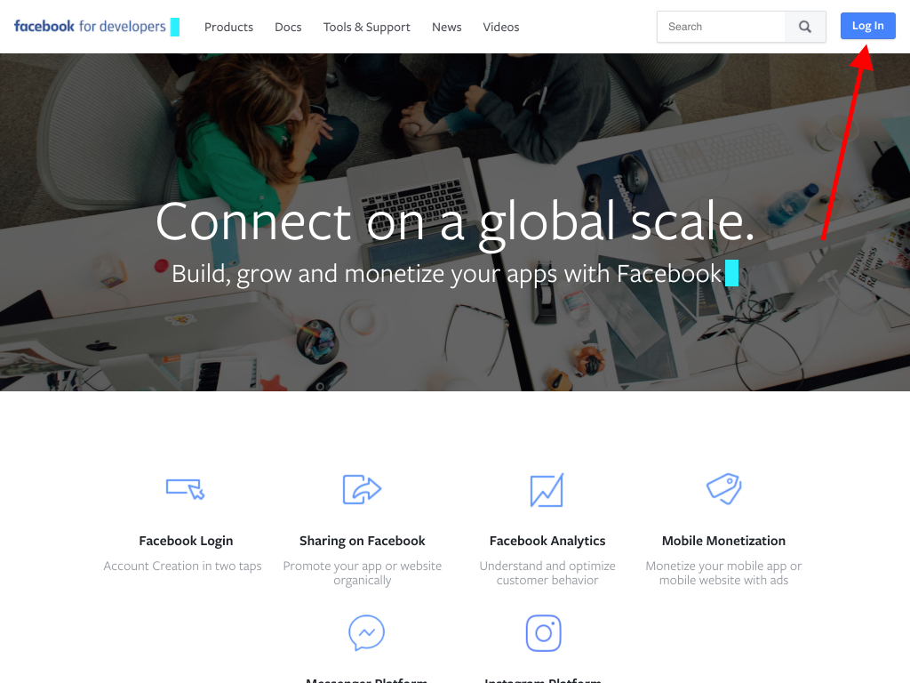
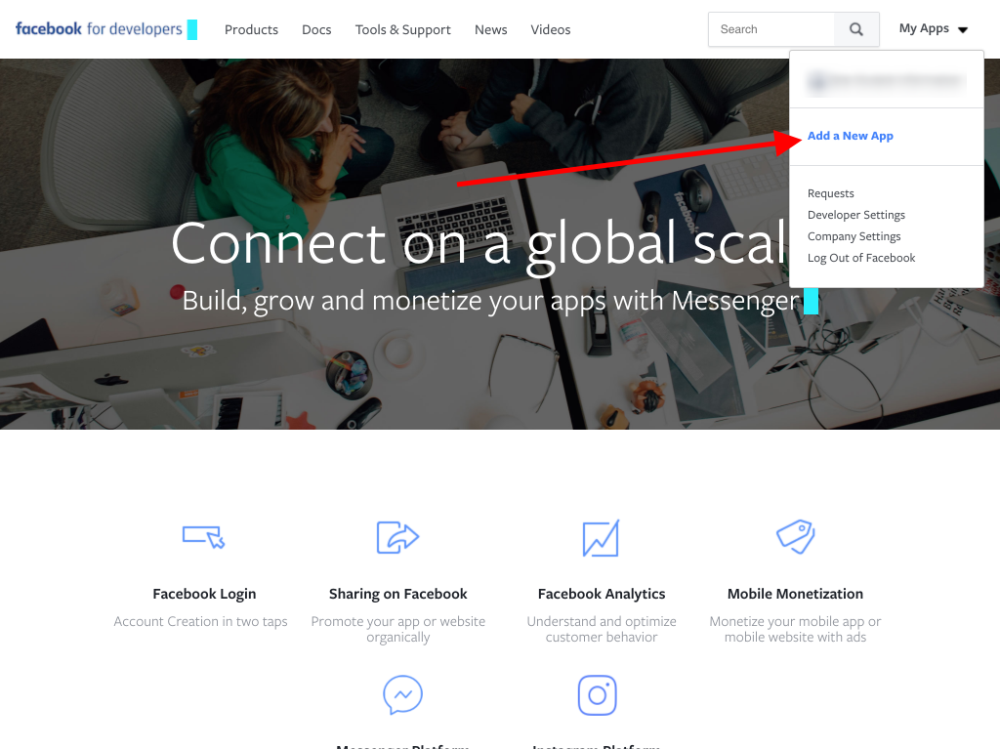
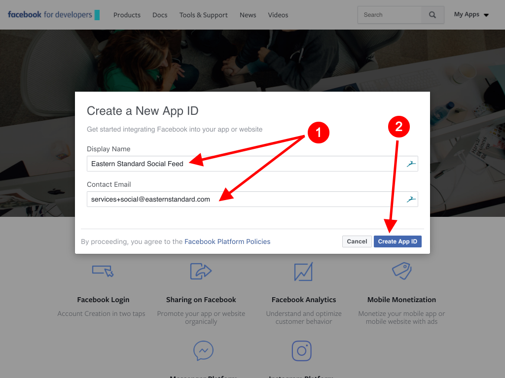
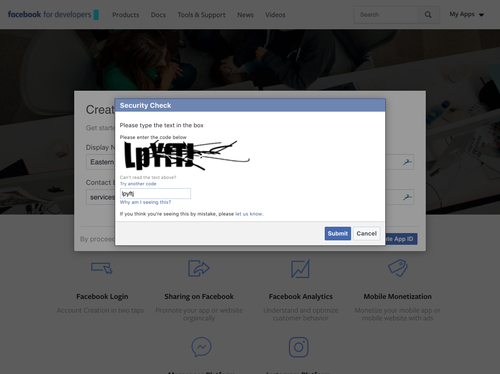
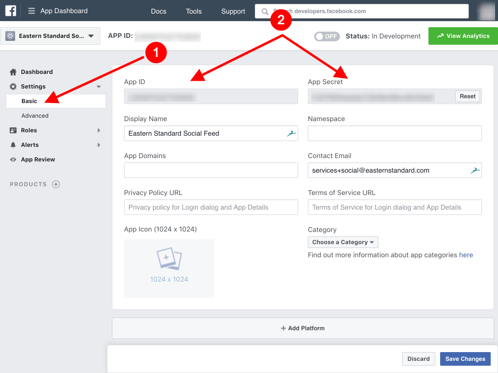
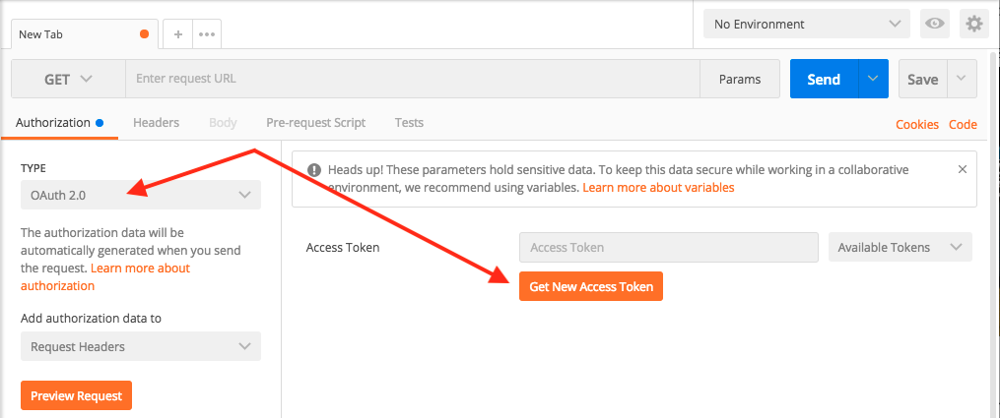
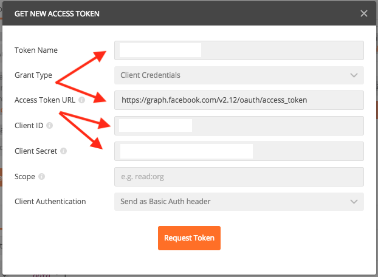
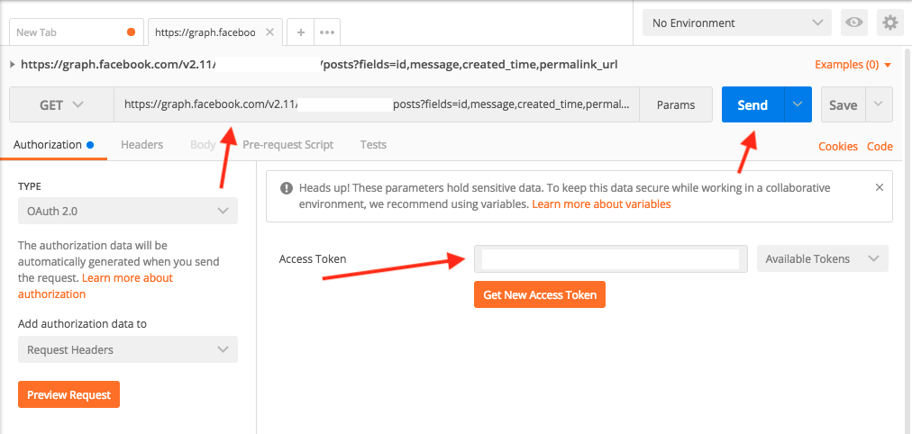

# Facebook

### Creating the Token

1. Open `https://developers.facebook.com` in an incognito window.
2. Log in with client-supplied credentials.

   

3. Under "My Apps" click "Add a New App."

   

4. Enter a Display Name and Contact Email, then click "Create App ID."

   

5. If a Security Check appears, fill it out.

   

6. Click "Settings &gt; Basic" and note the App ID and App Secret.

   

7. Note the actual page being accessed, not necessarily the user you logged in as. Going to that account's main page in facebook should show a list of pages managed by that account.

### Testing the Token

1. Open Postman and create a new GET request. In the Authorization tab, choose "OAuth 2.0" and click "Get New Access Token."

   

   1. Name your token in the "Token Name" field.
   2. Set the "Access Token URL" field to `https://graph.facebook.com/v2.12/oauth/access_token`
   3. Enter the App ID in the "Client ID" field.
   4. Enter the App Secret in the "Client Secret" field.
   5. Click "Request Token."

      

2. If the token request was successful, you should see text entered in the "Access Token" field.
3. In the URL field, enter `https://graph.facebook.com/v2.12/[page name]/posts?fields=id,message,created_time,permalink_url` substituting the actual page name for `[page name]`
4. Click "Send." The "Response" should fill up with a list of posts from that page.

   

