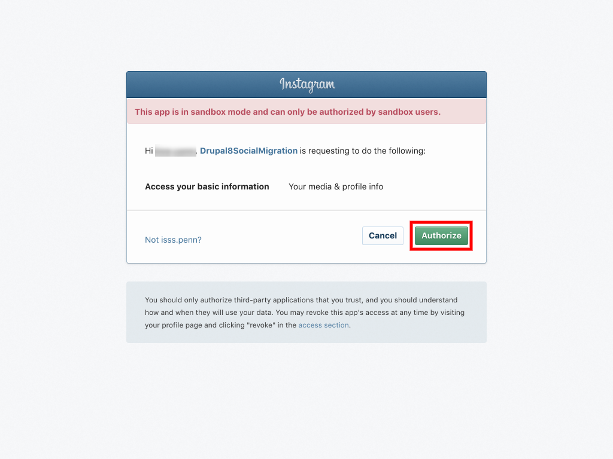

# Instagram

## Creating the Token

1. Log into `https://www.instagram.com/developer` in incognito mode and click "Log in." 

   

2. Click "Manage Clients." 

   

3. Enter the website being used to access this information, a phone number \(doesn't matter which one\), and a brief comment about what this app will be used for \(also doesn't matter\). Check the Terms of Use box and click "Sign up."

   

4. Click "Manage Clients" once more, then click "Register a New Client." 

   

5. Fill out the following fields; all values are required but only one must be a specific value:
   * Application Name
   * Description
   * Company Name
   * Website URL
   * Valid redirect URIs: **enter** `http://localhost` **here**
   * Privacy Policy
   * Contact email

     
6. Click the "Manage" button on the newly-created app. 

   

7. Click the "Security" tab.
   * Note the Client ID and Client Secret values.
   * **Uncheck** the box labeled "Disable implicit OAuth."
   * Click "Update Client."

     
8. **In a new tab** browse to `https://www.instagram.com/oauth/authorize/?client_id=[client id]&redirect_uri=http://localhost&response_type=token`, replacing `[client_id]` with the Client ID value from the previous step.

> ## danger::Important
>
> For this to work, you must remain logged into the user's account you are authorizing.

1. In the prompt that appears, click "Authorize." 

   

2. You will be taken to a site that may or may not display in your browser, depending on whether or not you have Apache running on your local computer. However, whether or not the page loads, the address in the URL bar should look like `localhost/#access_token=[really long bit]`. Take note of the `[really long bit]` - that is the access token.

## Testing the Token

1. Open Postman and create a new GET request.
2. In the URL field, enter `https://api.instagram.com/v1/users/self/media/recent?access_token=[access token from above]`.
3. Click "Send." The "Response" should fill up with a list of instagram posts from that user.

   

