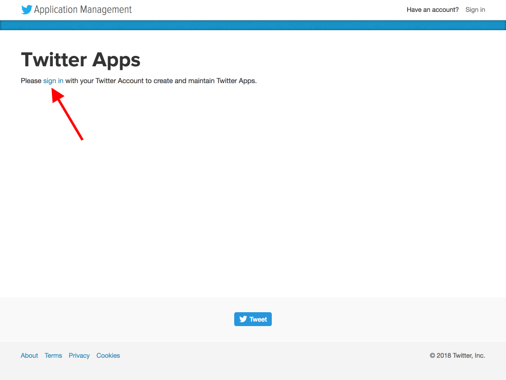
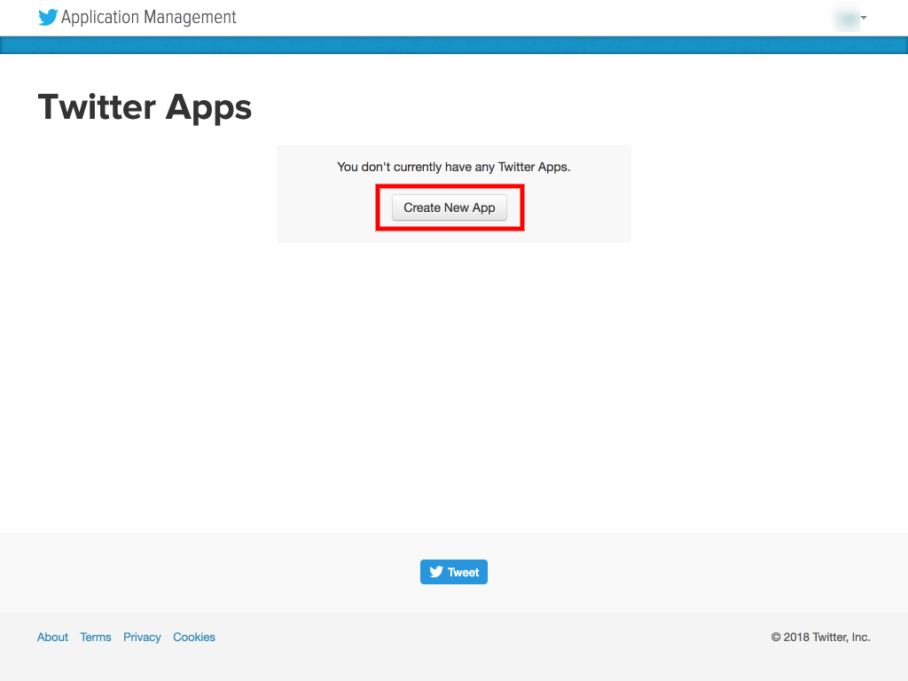
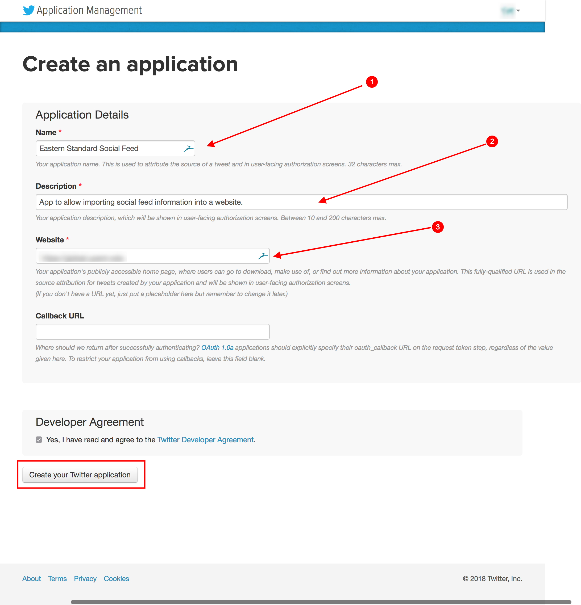
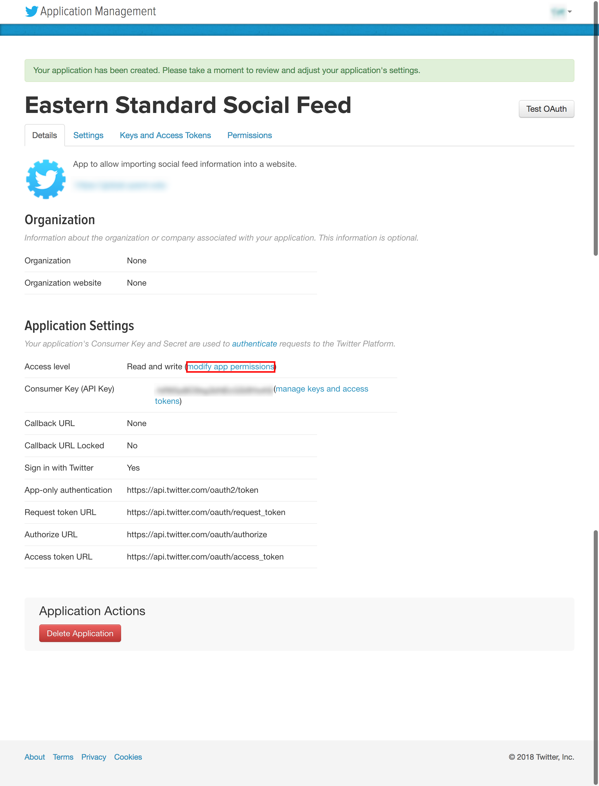
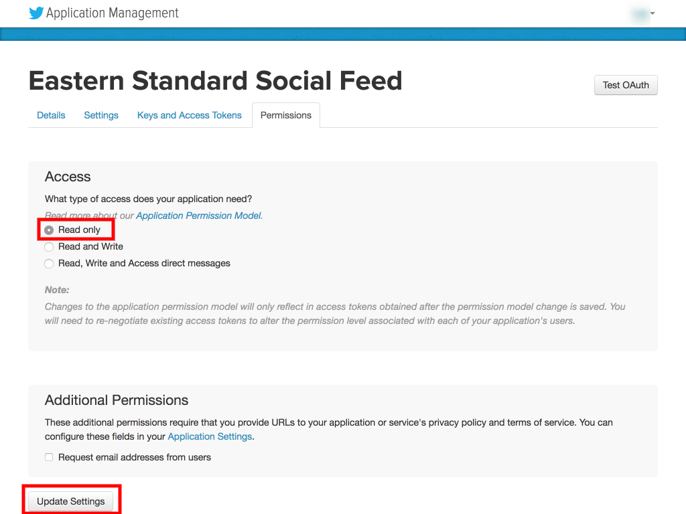
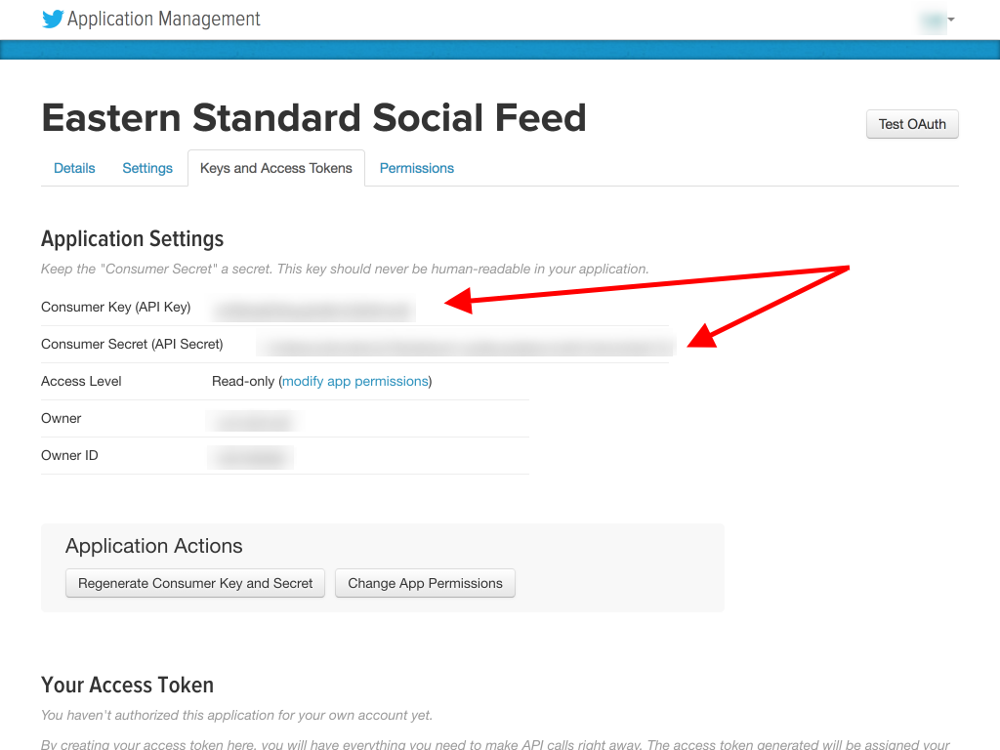
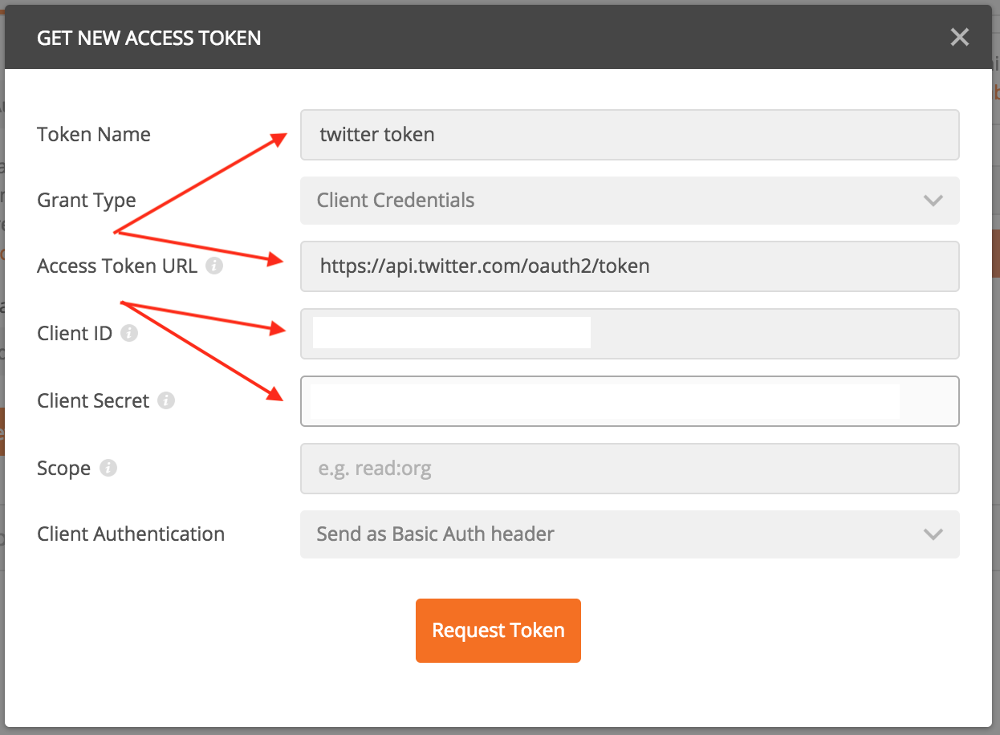
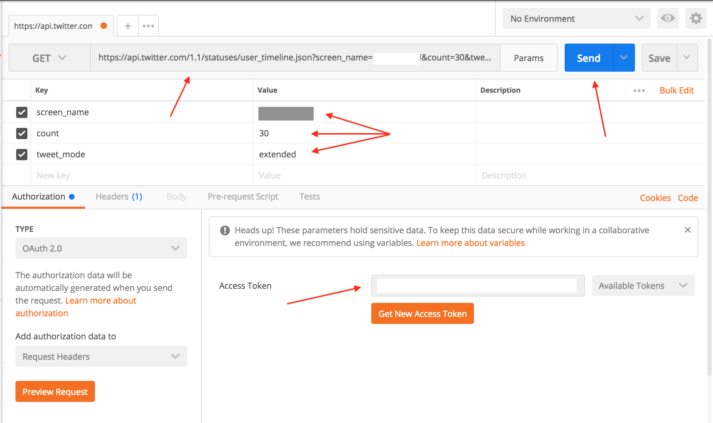

# Twitter

### Creating the Token

1. Log into `https://apps.twitter.com` in incognito mode and click "sign in."

   

2. Click "Create New App."

   

3. Enter a name, description, and website. Agree to the Developer Agreement, then click "Create your Twitter application."

   

4. \(optional\) In some cases, depending on the account, you may be forced to add a phone number to the Twitter account in question. This must be a phone capable of receiving text messages.
   1. Click the account's icon in the top right hand corner of the screen and go into the user's Settings, then click "Mobile" \(or browse to `https://twitter.com/settings/add_phone`\). Be sure to open this in a new tab.
   2. Enter your phone number and click "Continue."
   3. You will receive a text with a verification code. Enter that code.
   4. Switch back to the **Developer** tab.
   5. Click "Create your Twitter application" again.
   6. Once the app has been created, switch back to the **Settings** tab and remove your phone number.
   7. You can now close the **Settings** tab.
5. Under "Application Settings," click the link labeled "modify app permissions."

   

6. Change the application settings to "Read only" and click "Update settings."

   

7. Click the "Keys and Access Tokens" tab. Note the "Consumer Key \(API Key\)" and "Consumer Secret \(API Secret\)" values.

   

### Testing the Token

1. Open Postman and create a new GET request. In the Authorization tab, choose "OAuth 2.0" and click "Get New Access Token."

   

   1. Name your token in the "Token Name" field.
   2. Set the "Access Token URL" field to `https://api.twitter.com/oauth2/token`.
   3. Enter the API Key in the "Client ID" field.
   4. Enter the API Secret in the "Client Secret" field.
   5. Click "Request Token."

      

2. If the token request was successful, you should see text entered in the "Access Token" field.
3. In the URL field, enter `https://api.twitter.com/1.1/statuses/user_timeline.json`. Click the "Params" button and enter the following parameters:
   1. `screen_name`: the account name for the tweets you're pulling in.
   2. `count`: can be anything, but generally 30 is a good number.
   3. `tweet_mode`: set to `extended`.
4. Click "Send." The "Response" should fill up with a list of tweets from that user.

   

